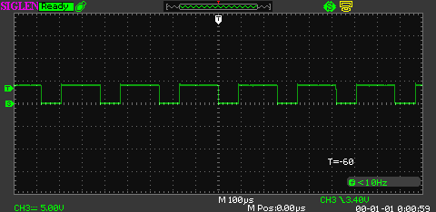
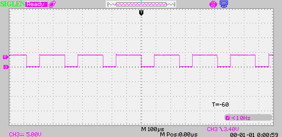

# 🌗 Инвертор скринов из осциллографа

Иногда осциллограф сохраняет скриншоты с чёрным фоном — в отчётах такие картинки плохо читаются и тратят много краски при печати. Этот мини-скрипт разворачивает цвета картинок внутри `.docx`, чтобы получать светлые, удобные для полиграфии версии отчётов.

## 🚀 Быстрый старт
1. Установите зависимости:
   ```bash
   pip install -r requirements.txt
   ```
2. Укажите пути к исходному и итоговому документам в начале `main.py` (можно передать через переменные окружения или аргументы командной строки — в примере они заданы как константы для наглядности):
   ```python
   input_docx = "input.docx"          # Исходный файл со скринами
   output_docx = "output_inverted.docx"  # Куда сохранить результат
   ```
3. Запустите обработку:
   ```bash
   python main.py
   ```
4. Готовый отчёт с инвертированными картинками появится в `output_docx`.

## 📦 Где лежит проект
- Репозиторий: https://github.com/dimchickka/invertColorsInsideWordFile/tree/main

## 📂 Что делает скрипт
- Открывает `.docx` как ZIP-архив и ищет изображения в `word/media/`.
- Инвертирует каждый файл (RGB и RGBA поддерживаются через Pillow).
- Собирает архив обратно в новый `.docx`.

## 🖼️ Пример визуального эффекта
Ниже — пример сигнала «до» и «после» инверсии (графики сохранены в папке `assets`).

| Оригинальный скрин | После инверсии |
| --- | --- |
|  |  |

## 🧭 Советы по использованию
- Перед запуском делайте копию исходного отчёта.
- Если в документе есть прозрачные PNG, скрипт сохранит альфа-канал.
- Для новых проектов удобно задать переменные `input_docx` и `output_docx` через переменные окружения или аргументы командной строки — в примере они просто объявлены в начале файла для наглядности.

## ⚙️ Требования
- Python 3.9+
- Зависимости из `requirements.txt`:
  - `pillow` — инверсия и пересохранение изображений
  - `lxml`, `python-docx`, `typing_extensions` — работа с DOCX и типами

Приятной работы с отчётами и экономии тонера! 🌟
